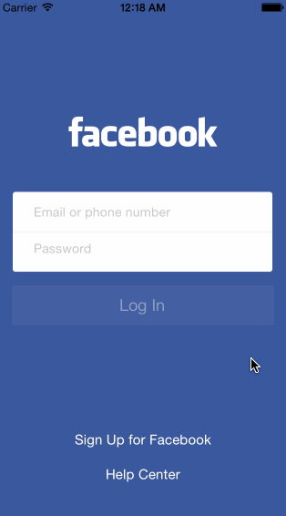

Facebook_SignIn
===============

Week 2 homework

Completed Tasks - 

Facebook login page
Tapping in the UITextField repositions the elements, as shown in the screenshots.
Tapping anywhere dismisses the keyboard
If email and password field are both blank, button should be disabled.
Password field should be secure with no autocorrection.
After tapping log in button, show the loading indicator in the button. After a 2 second delay, check the password.
If the password is 'password', transition to the next screen.
If the password is anything else, display the password error alert.
Facebook feed
Navigation bar should have the search button and messages button.
Immediately after launch, display the loading indicator.
